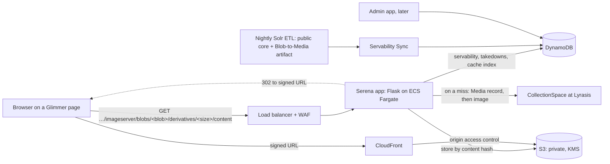
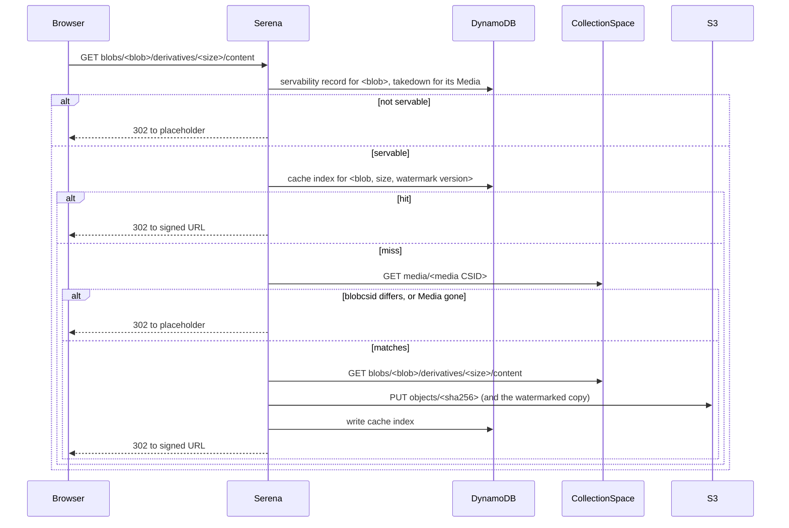

# Serena (the new CollectionSpace media server): Design

Richard Millet · started October 8, 2026 · for later changes see this file's history in git

> This file is the design document, and its only copy. It replaces the earlier proposals kept in Google Drive (see
> "How we got here"). Change it through pull requests, together with the code it describes.

## Summary

Serena serves the images that the UC Berkeley museums' public Glimmer portals show, at the URLs the legacy
`imageserver` uses today. It decides what it may serve from the nightly Solr ETL's output, keeps its own private copy
of every image it has served, and hands browsers short-lived signed links to that copy.

It runs as an AWS service: a Flask app on ECS Fargate behind a load balancer, a nightly Servability Sync, DynamoDB
for its records, private S3 buckets for the images and CloudFront for delivery.

Key decisions:

- **Same URLs, keyed by Blob CSID.** Glimmer keeps linking to
  `…/<tenant>/imageserver/blobs/<blob CSID>/derivatives/<size>/content`; nothing in Glimmer changes.
- **The ETL decides what is public.** A Blob CSID is servable only if it appears in last night's public Solr core
  and its Media record has no active takedown in Serena. Takedowns are the only override. Serena never changes the
  ETL's output and never reads CollectionSpace's Postgres.
- **Checked on every request.** Every request, cache hit or miss, goes through the servability check.
- **Never serve an orphaned Blob.** On a cache miss, Serena GETs the Media record through the CollectionSpace API
  and fetches the image only if the record's `blobcsid` still matches. The Media CSID comes from the ETL (Jira
  CSW-1027).
- **Fill on demand, keep forever.** The first request for an image fetches it from CollectionSpace with a read-only
  service account and stores it in Serena's own private, KMS-encrypted S3 bucket, keyed by its content hash. Nothing
  is pre-warmed, and nothing cached is ever deleted: a takedown stops serving it.
- **Signed links.** Serena answers a servable request with a 302 redirect to a CloudFront signed URL, valid for a
  15-minute window. Anything it won't serve gets a 302 to the museum's placeholder image, never an error.
- **Watermarks are made once.** For a museum that watermarks, Serena makes the watermarked copy the first time it's
  needed, stores it like any other image, and never serves the unwatermarked copy.
- **Takedowns within 24 hours.** A takedown in CollectionSpace reaches Serena with the next ETL run. Faster paths (a
  manual takedown in a Serena admin app, CollectionSpace Listeners, an ETL-side poller) are optional and come later.

## Background: the legacy imageserver

The legacy `imageserver` is a Django view in
[cspace-webapps-common](https://github.com/cspace-deployment/cspace-webapps-common) (`imageserver/views.py`),
deployed per museum from [cspace-webapps-ucb](https://github.com/cspace-deployment/cspace-webapps-ucb).

- **Flow.** It fetches the requested image from the museum's CollectionSpace with one shared service account (HTTP Basic, password in a `.cfg` file on the server), and
  returns the bytes. Every request goes to CollectionSpace: there is no caching anywhere.
- **Sizes.** For anonymous visitors, a per-museum list (`derivatives_served`) limits which sizes may be fetched.
  Signed-in Django users can fetch any size.
- **Watermarks.** A museum can turn on watermarking (today only the Botanical Garden does). The watermark is
  composited with ImageMagick on every request.
- **Failures.** Any error, of any kind, returns the museum's "image unavailable" placeholder (`404.svg`).

Problems this design fixes:

- **Speed and cost.** No caching, a new connection and login per request, whole images buffered in memory, and
  watermarks recomputed on every request. Crawlers walking the catalog make every request a slow trip to
  CollectionSpace.
- **Takedowns.** Serena checks every request against the ETL's public core and its own takedowns, so it can stop
  serving an image.
- **Secrets.** A plaintext service-account password on each server; Serena keeps it in AWS Secrets Manager.
- **Failures you can't see.** One bare `except:` hides timeouts, bad IDs and outages alike; Serena logs and counts
  each cause.

## CollectionSpace and ETL facts this design depends on

| Fact | Consequence for Serena |
| --- | --- |
| A Media record links to at most one Blob through its `blobcsid` field. A Blob has no field pointing back. | Serena needs the ETL to tell it each Blob's Media CSID (CSW-1027). |
| Replacing a Media record's image always creates a new Blob record. The old Blob is left orphaned; CollectionSpace doesn't delete it. | A Blob CSID is never reused for different content, so a cached image never goes stale. An orphaned Blob must not be served. |
| Publication (`approvedforweb` / `postToPublic`) and sensitivity (for PAHMA, the related Object's status) live on the Media and Object records, not on the Blob. | Serena doesn't evaluate them itself. The ETL already does, per museum, in `cspace-solr-ucb`. |
| The public Solr core lists only public Blob CSIDs, in `blob_ss`, `card_ss`, the primary image field, and the audio, video and 3D CSID fields. Non-public images are replaced by the museum's placeholder Blob. | The public core is Serena's list of what may be served. |
| The ETL runs nightly and its output is immutable. The team won't run it more often. | New images appear within 24 hours; takedowns through CollectionSpace take effect within 24 hours. |
| CollectionSpace is hosted at Lyrasis and supports only HTTP Basic authentication. | Serena uses one read-only service account per museum, password in Secrets Manager. |
| CollectionSpace generates the derivatives (Thumbnail, Medium, OriginalJpeg and so on) itself. | Serena never resizes. It makes only watermarked copies. |

Museum users' tolerances: up to 24 hours for new content to appear; 1 to 2 hours for a takedown. The 24-hour
takedown window through CollectionSpace is accepted for now (October 8, 2026); the admin app's manual takedown covers
the urgent case once it exists.

## Goals, non-goals and constraints

Goals:

- Serve every image URL Glimmer builds today, unchanged, for all five museums.
- Serve only what the ETL made public and Serena hasn't taken down. Never serve an orphaned Blob.
- Make a repeated request cheap: CollectionSpace is asked for a given image at most once, ever.
- Watermark for any museum that wants it, now or later, at no per-request cost.
- Scale horizontally; keep all state outside the app's tasks.
- Show what's happening: hits, misses, placeholders by reason, fetch time and errors by cause.

Non-goals:

- Audio and video. PAHMA's portal plays them through a cspace-services blob proxy, outside Serena. Tracked
  separately.
- Deciding what is public. That stays in the ETL.
- Cleaning up orphaned Blobs in CollectionSpace. That belongs to whoever runs CollectionSpace.
- Any change to Lyrasis's buckets or configuration.

Constraints (also in `CLAUDE.md`):

- Serena never reads CollectionSpace's Postgres; only the ETL does.
- The ETL's output is the first source of servability. Changes to the ETL for Serena must be additive and keep
  Glimmer working unchanged.
- Cached images are never deleted.
- No secret or personal data in the repository, a log or a test.

## Architecture overview

| Component | What it does |
| --- | --- |
| Serena app | Answers image requests: checks servability, finds or fetches the image, redirects |
| Servability Sync | Nightly, per museum: loads the ETL's Blob-to-Media artifact into the servability table |
| DynamoDB | Servability records, takedowns, the cache index, sync status |
| S3 buckets | One private, KMS-encrypted bucket per museum, holding every image Serena has fetched or watermarked |
| CloudFront | Delivers S3 objects to browsers, only through signed URLs; also serves the placeholders |
| Admin app (later) | Manual takedowns and unlocks |

## Serving a request

### URLs

Serena answers the paths Glimmer builds today, under each museum's prefix:

- `…/<tenant>/imageserver/blobs/<blob CSID>/derivatives/<derivative>/content`
- `…/<tenant>/imageserver/blobs/<blob CSID>/content` (the original file), for museums whose legacy
  `derivatives_served` allows `content`

Anything else under `imageserver/` gets the placeholder. Serena accepts only these two shapes, with a CSID in
CollectionSpace's format and a derivative name from the museum's list.

Each museum's list of derivatives starts as its legacy `derivatives_served` setting:

| Museum | Derivatives served |
| --- | --- |
| BAMPFA | Thumbnail, Medium |
| Botanical Garden | Thumbnail, Medium, OriginalJpeg |
| Cinefiles | Thumbnail, Medium, Original, content |
| PAHMA | Thumbnail, Medium, OriginalJpeg, content |
| UCJEPS | Thumbnail, Medium, OriginalJpeg, content |

### The steps

1. **Parse.** Check the path's shape, the tenant, the CSID's format and the derivative name. If any fails:
   placeholder.
2. **Servability.** Read the servability record for `<tenant>#<blob CSID>`. It must exist and belong to the latest
   applied ETL run (see Servability Sync). Then read the takedown record for its Media CSID; an active takedown
   means not servable. If not servable: placeholder.
3. **Cache index.** Look up `<tenant>#<blob CSID>#<derivative>`, or for a watermarking museum the watermarked entry
   for the museum's current watermark version. On a hit, go to step 6.
4. **Media check (miss only).** GET the Media record named in the servability record. If it's gone, deleted, or its
   `blobcsid` isn't the Blob asked for (the image was replaced after the ETL ran): placeholder, and nothing is
   fetched.
5. **Fetch and store (miss only).** GET the derivative from CollectionSpace, validate it (see Image fetch), hash it,
   PUT it to S3 under its hash if not already there, and write the cache index. For a watermarking museum, make the
   watermarked copy, store it the same way and index it too.
6. **Redirect.** Answer 302 with a CloudFront signed URL for the object.

The guarantee for orphaned Blobs: Serena never serves one on a cache miss, and on a hit not after the next Sync
(when the replaced Blob drops out of the public core).

### Responses

| Case | Response |
| --- | --- |
| Servable | 302 to a CloudFront signed URL; `Cache-Control: private, max-age` no longer than the URL's remaining life |
| Not servable, unknown path, bad CSID, size not allowed | 302 to the museum's placeholder; `Cache-Control: no-store`, so a later change takes effect at once |
| CollectionSpace failed or timed out on a miss | 302 to the placeholder; `no-store`; counted and logged as an upstream error |
| Serena itself failing (DynamoDB unreachable and so on) | 302 to the placeholder; logged as an internal error. Serena fails closed: when it can't check, it doesn't serve |

Serena never returns an error page or a stack trace to the browser. Every placeholder answer is logged with its
reason.

### Signed URLs

- CloudFront signed URLs with a trusted key group. The private key is in Secrets Manager; only the app's task role
  can read it.
- 15-minute windows: a URL's expiry is the end of the 15-minute window after the current one, so every request for
  the same object in the same window gets the same URL (the browser can reuse it) and each URL lives between 15 and
  30 minutes.
- S3 objects carry `Cache-Control: private, max-age=900`, so a browser doesn't keep using an image much past its
  URL's life.
- CloudFront's cache key leaves out the signature's query parameters, so the edge cache still works across windows.
  (To verify when built.)
- After a takedown, no new URL is issued. A URL already handed out works until it expires: at most 30 minutes.

### Placeholders

Each museum has its placeholder image (today `404.svg`), stored in a public prefix that CloudFront serves without a
signature. Whether museums want a different placeholder for "taken down" than for "not found" is an open question.

## Servability

### Records

| Table | Key | Fields |
| --- | --- | --- |
| Servability | `<tenant>#<blob CSID>` | Media CSID, kind (image, card, audio, video, 3D), ETL run ID |
| Takedowns | `<tenant>#<media CSID>` | state (taken down, or unlocked), who, when, why |
| Sync status | `<tenant>` | latest applied ETL run ID, when, row count |

A Blob is servable when its servability record exists, carries the latest applied run ID, and its Media CSID has no
active takedown.

### Servability Sync

A nightly job per museum, run after that museum's ETL finishes.

1. Read the ETL's Blob-to-Media artifact for the night (CSW-1027): one row per Blob CSID in the public core, with its
   Media CSID and kind. Artifacts are immutable and dated; Serena keeps a copy of each in S3.
2. **Sanity checks.** Stop, alarm and leave yesterday's state in place if the artifact is missing, malformed, from a
   night already applied, or differs from the last applied one by more than a set share of rows (in either
   direction).
3. Diff against the last applied artifact. Write new and changed rows with the new run ID; delete rows for Blobs no
   longer listed. Unchanged rows get the new run ID too, in bulk.
4. Update the sync-status record. Only then do the new rows count.

If a night's Sync fails, Serena keeps serving yesterday's set and alarms. That delays new images and ETL-driven
takedowns by a day; it never makes something servable that the ETL didn't list.

The Sync never fetches images. Buckets fill on demand.

### Takedowns

- **Through CollectionSpace:** unpublish the Media record, or mark its Object sensitive. The next ETL run drops the
  Blob from the public core; the next Sync stops Serena serving it. Within 24 hours.
- **In Serena (admin app, later):** an admin takes down a Media record by CSID. It takes effect on the next request.
  Nothing is deleted; the cached images stay in S3. An admin can later unlock it, which removes Serena's override and
  hands servability back to the ETL's state.
- **Optional, later:** CollectionSpace Listeners (custom Java, with retries, since CollectionSpace's framework has no
  outbound calls of its own) or an ETL-side poller of Postgres, either feeding the takedown table. Listeners are
  optional in CollectionSpace, so Serena can't depend on them.

## Image fetch

- **Account.** One read-only CollectionSpace service account per museum, HTTP Basic. Its password is in Secrets
  Manager, read at task start-up, never logged and never stored anywhere else.
- **Calls.** `GET /cspace-services/media/<media CSID>` (the check), then
  `GET /cspace-services/blobs/<blob CSID>/derivatives/<derivative>/content` or `…/blobs/<blob CSID>/content`.
- **Connections.** One pooled HTTP session per museum per task, with timeouts and retries for transient errors only.
- **Rate limit.** A cap on concurrent fetches per museum, per task. Tasks times the cap stays within a rate to be
  agreed with Lyrasis.
- **Duplicate first fetches.** Within a task, simultaneous requests for the same missing image wait on one fetch.
  Across tasks, duplicates can happen; they cost one extra fetch, store nothing twice (same hash), and are logged.
- **Validation.** The response must be 200 with an image content type, within a size limit, and decodable. Anything
  else: placeholder, nothing stored. (The checks are to be revisited; see Open questions.)
- **Streaming.** Bodies are streamed to S3 (multipart for large originals) while hashed, not held whole in memory.

## Storage

- **Buckets.** One per museum, private, Block Public Access on, encrypted with a customer-managed KMS key, readable
  only by CloudFront's origin access control and the app's task role. Versioning on; no lifecycle rule deletes
  anything. S3 Intelligent-Tiering for cost.
- **Keys.** `objects/<sha256>`, like Nuxeo's content-addressed store, so identical bytes are stored once. The object
  records its content type.
- **Cache index.** `<tenant>#<blob CSID>#<derivative>` → hash, content type, size, fetched-at. Watermarked copies:
  `<tenant>#<blob CSID>#<derivative>#wm<version>` → hash of the watermarked bytes, plus the hash it was made from.
- **Never deleted.** A takedown leaves objects and index entries in place. Unlocking a takedown serves them again
  without another fetch.

## Watermarks

- Per museum: on or off, the watermark image, transparency and size (as a share of the image's longer side), the
  derivatives watermarked, and a version number that changes whenever any of these change.
- Any museum may turn watermarking on, now or later. Today only the Botanical Garden does, on everything it serves.
- The watermarked copy is made once, with pyvips, from the stored original derivative, and indexed under the current
  version. Changing a museum's watermark makes new copies on demand; old ones stay, unused.
- For a watermarking museum, Serena never issues a signed URL for an unwatermarked copy.

## Admin app (later)

A small Serena web app for museum staff or the team. First feature: take down a Media record, and unlock one. Later,
perhaps: look up why an image is or isn't served, and sync and fetch status. How admins sign in is an open question.

## Infrastructure and operations

- **Compute.** Flask behind Gunicorn on ECS Fargate, behind an ALB with AWS WAF (rate limits and bot control, since
  the catalog is crawled routinely). Fargate rather than Lambda: no cold starts for pyvips, and warm connection pools
  for crawler bursts. The Sync runs as a scheduled Fargate task.
- **Routing.** The legacy imageserver's paths on each museum's webapps host are routed to Serena's ALB, one museum at
  a time.
- **Infrastructure as code.** Terraform, in `deploy/`, with state in S3. No secrets in Terraform files or state.
- **Least privilege.** The app's task role can read the servability, takedown and index tables, write the index, put
  objects, use the KMS key and read its own secrets. The Sync's role can write servability and sync status and read
  the ETL's artifacts. Neither can delete S3 objects.
- **Logs and metrics.** Structured JSON logs to CloudWatch and embedded metrics: requests, hits, misses, placeholders
  by reason, Media-check mismatches, fetch time, upstream errors by cause, duplicate fetches, Sync row counts and
  failures. No passwords, tokens, signed URLs or personal data in logs.
- **Local development.** Docker Compose with a CollectionSpace simulator, as in the BMU.

## Migration

1. Build Serena and deploy it beside the legacy imageserver.
2. Get the ETL change (CSW-1027) in for every museum; start the Sync.
3. Route one low-traffic museum's `imageserver` paths to Serena; compare with the legacy imageserver.
4. Move the other museums one at a time.
5. Decommission the legacy imageserver and remove it from cspace-webapps-common.

## How we got here

The design went through several versions in Google Drive before this file:

1. **A caching proxy keyed by Media CSID (August 2026).** CloudFront, Flask on Fargate, S3 as a permanent store, one
   DynamoDB record per Media CSID checked on every request, a nightly Servability Sync, and three required
   CollectionSpace Listeners for takedowns. It changed the portals' URLs to Media CSIDs.
2. **Keep the legacy URLs.** Changing Glimmer wasn't acceptable, so URLs stay keyed by Blob CSID, and the ETL's
   public core, the same source Glimmer uses, became the list of what may be served.
3. **Copy Lyrasis's bucket (September 2026).** Sync Lyrasis's S3 bucket into ours with AWS DataSync, to avoid the
   CollectionSpace API.
4. **Serve from Lyrasis's buckets through CloudFront (October 1, 2026).** Signed URLs straight to the museums'
   Lyrasis-hosted buckets.
5. **Our own buckets, filled from the API (October 8, 2026).** After an update from Lyrasis, Serena won't sync with
   or serve from Lyrasis's buckets. Instead it fetches each image from CollectionSpace's API the first time it's
   asked for, and keeps it in its own empty-at-start buckets. Listeners became optional, and orphaned Blobs are
   handled by the Media check on a miss and the Sync on a hit.

## Open questions and findings

- **Image validation.** Which checks to run on a fetched image before storing it (content type, size, decode,
  dimensions).
- **Sensitive derivatives.** Check that the ETL treats every derivative of a sensitive image as sensitive, and that
  catalog cards (`card_ss`) are handled as each museum expects.
- **Rate limit.** Agree a fetch rate with Lyrasis.
- **URL forms in use.** Confirm from Glimmer and the access logs which derivative names and URL shapes are requested
  (including `blobs/<CSID>/content` and 3D), and whether any other app still uses the legacy imageserver.
- **Signed-in users.** The legacy imageserver serves everything to signed-in Django users. Serena serves only the
  public core. Do any internal apps still need the rest?
- **Placeholders.** One placeholder, or different ones for "taken down" and "not found"?
- **Admin app sign-in.** CalNet, CollectionSpace credentials, or something else.
- **CloudFront cache key.** Confirm that signed-URL query parameters are left out of the cache key.
- **Sync thresholds.** The share of rows that may change in a night before the Sync stops.
- **Image validation of existing derivatives.** Whether CollectionSpace's derivatives for very large originals are
  worth caching or should be refused by size.

## Testing

Unit and integration tests run in CI against the CollectionSpace simulator and local stand-ins for AWS. Checks that
need a real CollectionSpace tenant or AWS are in `docs/testing-checklist.md`.
