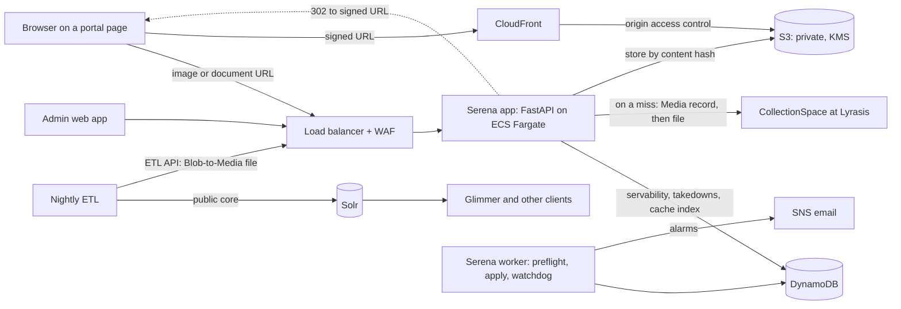
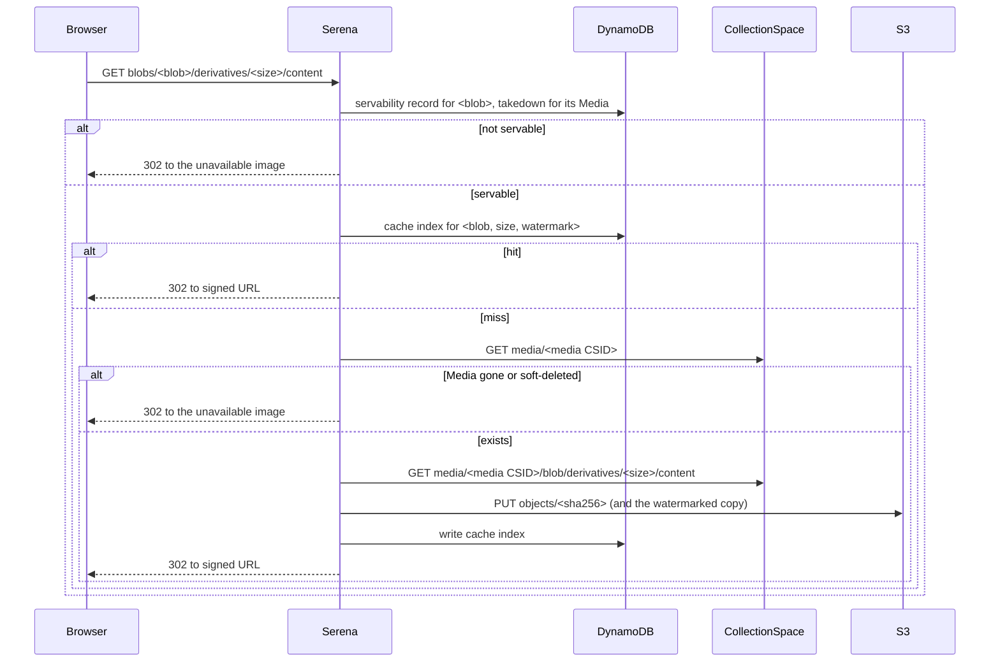

# Serena (the new CollectionSpace media server): Design

Richard Millet · started October 8, 2026 · for later changes see this file's history in git

> This file is the design document, and its only copy. It replaces the earlier proposals kept in Google Drive (see
> "How we got here"). Change it through pull requests, together with the code it describes.

## Summary

Serena serves the images and documents that the UC Berkeley museums' public portals show, at the URLs the legacy
`imageserver` uses today. It decides what it may serve from the nightly Solr ETL's output, keeps its own private copy
of every file it has served, and hands browsers short-lived signed links to that copy.

It runs as an AWS service: a FastAPI app on ECS Fargate behind a load balancer, a worker that takes in each night's
ETL output, an admin web app, DynamoDB for its records, private S3 buckets for the files and CloudFront for delivery.

Key decisions:

- **Same URLs, keyed by Blob CSID.** Glimmer and any other client keep requesting
  `…/<tenant>/imageserver/blobs/<blob CSID>/derivatives/<size>/content` and `…/blobs/<blob CSID>/content`; nothing
  in Glimmer changes. A URL keyed by Media CSID is added for clients that want it.
- **The ETL decides what is public.** Each night the ETL hands Serena a Blob-to-Media file listing every Blob in the
  public core, with its Media CSID, kind and access. Serena serves a Blob only if that file lists it as public, in a
  kind Serena serves, and its Media record has no takedown in Serena. Serena never reads Solr or CollectionSpace's
  Postgres.
- **The ETL and Serena move together.** The ETL drives each night through Serena's ETL API: a night succeeds only
  when both the public core and Serena have taken it in. If Serena can't be reached, the public core is loaded
  anyway and Serena catches up.
- **Checked on every request.** Every request, cache hit or miss, goes through the servability check.
- **All calls to CollectionSpace go through the Media service.** On a cache miss Serena checks that the Media
  record exists and isn't deleted (the light check), then fetches the Media record's current file. It never compares
  Blob CSIDs.
- **Fill on demand, keep forever.** The first request for a file fetches it from CollectionSpace with a read-only
  service account and stores it in Serena's own private, KMS-encrypted S3 bucket, keyed by its content hash. Nothing
  is pre-warmed, and nothing cached is ever deleted: a takedown stops serving it.
- **Signed links.** Serena answers a servable request with a 302 redirect to a CloudFront signed URL, issued in
  15-minute windows and valid for 15 to 30 minutes. Anything it won't serve gets a 302 to the museum's unavailable
  image, never an error.
- **Restricted files only with a portal's signature.** The ETL decides, with each museum's rules, which files are
  restricted; Serena serves a restricted file only with a valid link the portal signed, and only for kinds the museum
  allows (today Cinefiles' PDFs, signed by Glimmer). Decided October 9, 2026.
- **Watermarks are made once.** For a museum that watermarks, Serena makes the watermarked copy the first time it's
  needed, stores it like any other file, and never serves an unwatermarked copy of a size it watermarks.
- **An admin web app from the start.** Museum and team admins see runs, alerts and why a file is or isn't served;
  they take files down, change settings and recover from failed nights.
- **No personal data in logs.**

## Serena and its clients

Three things are easy to blur, and this design keeps them apart:

| Part | What it is | Reads | Produces |
| --- | --- | --- | --- |
| The ETL (`cspace-solr-ucb`) | A nightly job per museum | CollectionSpace's Postgres | The public Solr core, and the Blob-to-Media file for Serena |
| The public core | Data | n/a | What every client of the core sees |
| Glimmer, and other clients | Applications | The public core, live | Requests to Serena's URLs |
| Serena | The media server | The Blob-to-Media file (never Solr) | Images and documents |

Glimmer is the client we know; others may read the public cores, and this design assumes they do. Serena depends
only on the public core, through the Blob-to-Media file, never on Glimmer. Changes on Glimmer's side (new URL
shapes, a move to Media CSIDs) follow Glimmer's own timeline.

Two rules follow (decided October 9, 2026):

- **Each night:** the public core and Serena's records describe the same ETL run, except on a "partial" night (see
  The nightly sequence).
- **Each release:** Serena serves every URL shape and kind its clients build.

## Background: the legacy imageserver

The legacy `imageserver` is a Django view in
[cspace-webapps-common](https://github.com/cspace-deployment/cspace-webapps-common) (`imageserver/views.py`),
deployed per museum from [cspace-webapps-ucb](https://github.com/cspace-deployment/cspace-webapps-ucb).

- **Flow.** It fetches the requested file from the museum's CollectionSpace with a service account and returns the
  bytes. Every request goes to CollectionSpace: there is no caching anywhere.
- **Sizes.** A per-museum setting (`derivatives_served`) names the sizes it serves.
- **Watermarks.** A museum can turn on watermarking (today only the Botanical Garden does). The watermark is
  composited with ImageMagick on every request.
- **Failures.** Any error returns the museum's "image unavailable" picture (`404.svg`).

What Serena improves:

- **Speed and cost.** No caching, a new connection and login per request, whole files held in memory, and watermarks
  recomputed on every request. Crawlers walking the catalog make every request a slow trip to CollectionSpace.
  Serena fetches a file once and serves it from S3 through CloudFront.
- **Failures you can see.** Serena logs and counts each cause of a file not being served, and shows them in its admin
  app.

## CollectionSpace and ETL facts this design depends on

| Fact | Consequence for Serena |
| --- | --- |
| A Media record links to at most one Blob through its `blobCsid` field. A Blob has no field pointing back. | Serena needs the ETL to tell it each Blob's Media CSID (Jira CSW-1027). |
| Replacing a Media record's image always creates a new Blob record. The old Blob is left orphaned; CollectionSpace doesn't delete it. | A Blob CSID is never reused for different content. |
| The Media service serves a Media record's current file: `media/<csid>/blob/content` and `media/<csid>/blob/derivatives/<name>/content`. It also returns soft-deleted Media records and their files. | Serena fetches through the Media service, after checking the record isn't deleted. |
| Publication (`approvedforweb` / `postToPublic`), sensitivity (for PAHMA, the related Object's status) and access (for Cinefiles, the document's access code and record status) live on the Media, Object and Organization records, not on the Blob. | Serena doesn't evaluate them. The ETL does, per museum, in `cspace-solr-ucb`, and tells Serena the result (see Restricted files). |
| The public core lists Blob CSIDs in `blob_ss`, `card_ss`, the primary image field, the audio, video and 3D CSID fields, and (Cinefiles) `pdf_ss`. At PAHMA, images that aren't public appear as its restricted-image Blob; the other museums leave them out. Cinefiles documents carry an access code; only code 4 ("World") is public. | The Blob-to-Media file mirrors these fields, with a kind and an access value per Blob. |
| Cinefiles staff set a document's access in CollectionSpace: "Access code override" on the document (Object) record, otherwise "Publication access code" on the Organization record named in its Source field. The values are PFA Staff Only, In House Only, Campus (UCB), Education (\*.edu) and World. A document's Record status must be approved for it to be in the public core. Cinefiles' ETL has no Media-level publish flag: every Media record of an included document is in the public core. | For Cinefiles, the access code restricts a PDF and the record status removes a whole document; unpublishing a Media record changes nothing. |
| Cinefiles' access code is computed into a table (`cinefiles_denorm.doclist_view`, column `code`) by a nightly "denorm" job that Lyrasis runs, not RTL; the ETL reads that table. | Restriction for Cinefiles depends on that job having run. The ETL takes a PDF's access from the same `code` that becomes `code_s` in the public core, so Glimmer and Serena agree. |
| The ETL runs nightly, starting at 03:01 for all museums in parallel. It empties each core and reloads it; if a load fails it reloads the previous night's data. Its output is immutable. | New files appear, and CollectionSpace-driven takedowns take effect, within about 24 hours. |
| CollectionSpace is hosted at Lyrasis. Designs assume only HTTP Basic authentication (newer CollectionSpace versions also have OAuth2, not checked for the hosted version). | Serena uses one read-only service account per museum, password in Secrets Manager. |
| CollectionSpace generates the image derivatives (Thumbnail, Small, Medium, FullHD, OriginalJpeg) itself. | Serena never resizes. It makes only watermarked copies. |
| Most CSIDs are UUIDs, but CollectionSpace doesn't require it: a record created by an import keeps the CSID it was given. PAHMA's restricted-image Blob has the shorter CSID `59a733dd-d641-4e1a-8552`. | Serena doesn't require a CSID to be a UUID (see URLs). |

Museum users' tolerances: up to 24 hours for new content to appear; 1 to 2 hours for a takedown. The 24-hour
takedown window through CollectionSpace is accepted for now (October 8, 2026); the admin app's takedown covers the
urgent case.

## Goals, non-goals and constraints

Goals:

- Serve every URL shape and kind Serena's clients build today, unchanged, for all five museums.
- Serve only what the ETL lists as public and Serena hasn't taken down.
- Make a repeated request cheap: CollectionSpace is normally asked for a given file only once, ever.
- Watermark for any museum that wants it, now or later, at no per-request cost.
- Scale horizontally; keep all state outside the app's tasks, apart from short-lived caches and counts that a task
  can lose without harm (a museum's settings for a minute, unserved-request counts until the next write).
- Show what's happening, to the team and to museum admins: requests, cache hits and misses, files not served and why,
  fetch times and errors, nightly runs.

Non-goals:

- Deciding what is public. That stays in the ETL.
- Cleaning up orphaned Blobs in CollectionSpace. That belongs to whoever runs CollectionSpace.
- Any change to Lyrasis's buckets or configuration.
- Changes to Glimmer, apart from one: Glimmer signs the links it gives signed-in readers to restricted files (see
  Restricted files).

Constraints (also in `CLAUDE.md`):

- Serena never reads CollectionSpace's Postgres or Solr; only the ETL reads Postgres.
- The ETL's output is the first source of servability. Changes to the ETL for Serena must be additive and leave every
  reader of the public core working unchanged.
- Cached files are never deleted.
- No secret or personal data in the repository, a log or a test.

## Architecture overview



| Component | What it does |
| --- | --- |
| Serena app | Answers file requests (checks servability, finds or fetches the file, redirects); serves the ETL API and the admin app |
| Worker | Preflights and applies each night's Blob-to-Media file; runs the watchdog |
| DynamoDB | Servability records, takedowns, runs, settings, alerts, unserved-request counts, the cache index, the audit log |
| S3 buckets | One private, KMS-encrypted bucket per museum, holding every file Serena has fetched or watermarked, and each applied Blob-to-Media file |
| CloudFront | Delivers files from S3 to browsers, only through signed URLs; serves the unavailable images without a signature |
| Admin web app | Runs and alerts, settings, takedowns, restricted-image Blobs, why a file is or isn't served |
| SNS | Emails alarms to the team's mailing list |

## Serving a request

### URLs

Serena answers the paths its clients build today, under each museum's prefix:

- `…/<tenant>/imageserver/blobs/<blob CSID>/derivatives/<derivative>/content`
- `…/<tenant>/imageserver/blobs/<blob CSID>/content` (the original file)
- Cinefiles only: `…/cinefiles/imageserver/blobs/<blob CSID>/content/linked_pdf:<suffix>` and
  `…/content/inline_pdf:<suffix>`, which Glimmer builds for PDFs. The suffix is up to 512 characters with no slash
  (decided October 9, 2026); Serena accepts and ignores it, and never logs it, because it carries the signed-in
  visitor's email address. For a signed-in reader, Glimmer adds a signature as query parameters (see Restricted files).
- Added for clients that use Media CSIDs (pull request 15 in the plan):
  `…/<tenant>/imageserver/media/<media CSID>/blob/derivatives/<derivative>/content` and
  `…/media/<media CSID>/blob/content`.

Anything else under `imageserver/` gets the unavailable image. Serena accepts only these shapes, with a CSID in
CollectionSpace's format and a derivative name from the museum's list, matched exactly. It answers `GET` and `HEAD`,
and ignores any query string apart from the signature parameters on a request for a restricted file (see Restricted
files). A request under a museum Serena doesn't serve gets the default unavailable image.

A CSID is 1 to 64 letters, digits and hyphens (decided October 9, 2026). That covers the usual UUIDs and the CSIDs
that aren't UUIDs, such as PAHMA's restricted-image Blob. The same rule applies to the CSIDs in the Blob-to-Media file
and in each museum's configuration. It keeps malformed paths out; whether a Blob is served is decided only by the
nightly file.

Each museum's list of derivatives (decided October 9, 2026):

| Museum | Derivatives served | Original file of images and cards (`/content`) |
| --- | --- | --- |
| BAMPFA | Thumbnail, Medium | No |
| Botanical Garden | Thumbnail, Medium, OriginalJpeg | No |
| Cinefiles | Thumbnail, Small, Medium, FullHD, OriginalJpeg | Yes |
| PAHMA | Thumbnail, Small, Medium, FullHD, OriginalJpeg | Yes |
| UCJEPS | Thumbnail, Small, Medium, FullHD, OriginalJpeg | Yes |

3D files and PDFs are served as their original file at every museum, whatever this table says (see Kinds). The lists
match what each museum's portal can request today. Each museum's exact list is to be revisited once
the access logs show which sizes are requested (see Open questions).

### Kinds

Each Blob in the Blob-to-Media file has a kind (decided October 9, 2026):

| Kind | Served | As | Checks on fetch | Watermarked |
| --- | --- | --- | --- | --- |
| image, card | Yes | Derivatives, and the original where the museum allows it | Image content type, decodable, size limit | If the museum watermarks that size |
| 3D | Yes | The original file only | An allowlist of 3D content types, size limit | No |
| pdf | Yes if its access is public; if restricted, only with a valid signed link | The original file only | `application/pdf`, size limit | No |
| audio, video | Not yet (see Open questions) | n/a | n/a | No |

A Blob of any kind whose `access` is restricted is served only as Restricted files says. A request for a derivative
of a 3D or PDF Blob gets the unavailable image (reason "no derivatives for this kind").
Size limits are per museum, set in the admin app. The starting values are 500 MB for images and cards, 1 GB for 3D
files and 200 MB for PDFs, for every museum (decided October 9, 2026); the values for production are to be confirmed
(see Open questions).

### Restricted files

Any museum may have images or documents that mustn't be public: PAHMA and Cinefiles do today. Which files are
restricted is decided by the ETL, with each museum's own rules; Serena never encodes a museum's rule (decided October
9, 2026). It sees only the result, per Blob, in the Blob-to-Media file:

| In the nightly file | Meaning | Serena |
| --- | --- | --- |
| Not listed | Not in the public core | Never serves it (`not_listed`) |
| `access` restricted | In the public core, but only for readers a portal vouches for | Serves it only with a valid signed link, for a kind the museum allows signed access to; otherwise never |
| `access` public | Public | Serves it to anyone |

What each museum's ETL does today:

| Museum | Withheld or restricted by the ETL |
| --- | --- |
| PAHMA | Images not approved for the web, or whose Object is sensitive: left out of the public core and shown as its restricted-image Blob (see Restricted-image Blob). |
| Cinefiles | Documents whose record status isn't approved: left out, with all their files. PDFs of documents whose access code isn't World: listed with `access` restricted; Glimmer shows them only to readers signed in to it, who have accepted Cinefiles' copyright terms. Page images of those documents: public, which Cinefiles staff accept (October 9, 2026). See The Blob-to-Media file for the rule. |
| BAMPFA, Botanical Garden, UCJEPS | Files their ETL rules don't publish: left out. |

Signed access is part of each museum's configuration (its YAML file; not a setting admins change), listing the kinds
it applies to: Cinefiles allows it for `pdf`; no other museum allows it today. A restricted Blob of any other kind,
or at a museum without signed access, is never served.

#### Signed links

A portal vouches for a reader by signing the link. Today that is Glimmer, for Cinefiles' PDFs: it adds four query
parameters to the PDF links it renders for a signed-in reader (decided October 9, 2026):

```
…/cinefiles/imageserver/blobs/<blob CSID>/content/linked_pdf:?exp=<exp>&uid=<uid>&kid=<kid>&sig=<sig>
```

- `exp`: the link's expiry, in Unix seconds (UTC). Glimmer sets it 15 minutes ahead.
- `uid`: the reader's account ID in the portal: 1 to 20 digits (Glimmer's `User#id`). Never an email address;
  anything but digits is refused as `signature_invalid` (decided October 9, 2026).
- `kid`: the ID of the key that signed it.
- `sig`: HMAC-SHA256 of the string `v1`, `<tenant>`, `<blob CSID>`, `<exp>`, `<uid>`, joined by newlines (no
  trailing newline), in base64url without padding.

Test vector, with an example key that isn't a secret:

```
key:     example-key-not-a-secret
string:  v1\ncinefiles\n0a1b2c3d-1111-2222-3333-444455556666\n1791590400\n12345
sig:     pZqh6CO0MnUTOb6m_KMQtytCwTauTCXr5ZZb-5aGDWg
```

**What Serena checks,** for a restricted Blob of a kind the museum allows signed access to, as part of step 2 of a
request (see The steps):

- the four parameters are present and well formed, and `kid` names one of the museum's current keys;
- `exp` hasn't passed (60 seconds of clock difference allowed) and is no more than 60 minutes ahead;
- the signature matches, recomputed over the tenant and Blob CSID in the path and compared in constant time.

If they pass, the request goes on like any other and gets a 302 to a CloudFront signed URL, with the usual 15-to-30
minute life (decided October 9, 2026); the 302 is sent with `Cache-Control: no-store`, so the browser asks Serena
again next time. Like any signed URL, the CloudFront URL works for whoever holds it until it expires, as Glimmer's
signed link does for its 15 minutes.

If they don't pass, the unavailable image, with the reason `restricted` (no signature, or a kind without signed
access), `signature_invalid` or `signature_expired`. A public Blob is served with or without a signature.

**Keys.** One per museum and environment, at least 32 random bytes, generated by the DevOps team and kept in AWS
Secrets Manager for Serena and in the portal's secret store. Each has a key ID. During a rotation the portal signs
with the new key and Serena accepts the new and the previous one.

**Logs.** The signature is never logged. The reader's `uid` is neither logged nor recorded unless a museum wants
records of who read which file (F8).

**Timeline.** Glimmer's change is a story in the HMP project. Cinefiles moves to Serena only once Glimmer signs its
links in production (see Migration).

### The steps



1. **Parse.** Check the path's shape, the tenant, the CSID's format and the derivative name. If any fails: the
   unavailable image.
2. **Servability.** Read the servability record for `<tenant>#<blob CSID>`; it must exist, its kind must be one Serena
   serves, and its access must be public, or restricted with a valid signed link for a kind the museum allows signed
   access to (see Restricted files). The request must fit the kind: a derivative only of an image or card, and an
   image's or card's original file only where the museum serves originals. Then read the takedown record for its Media
   CSID, strongly consistent, so a takedown takes effect on the next request; an active takedown means not servable. If
   not servable: the unavailable image, with the reason (see Requests Serena doesn't serve).
3. **Cache index.** Look up `<tenant>#<blob CSID>#<derivative>`, or for a watermarking museum the watermarked entry for
   the museum's current watermark settings. On a hit, go to step 6. If only the watermarked copy is missing and the
   unwatermarked copy is stored, make the watermarked copy from it (see Watermarks), without steps 4 and 5.
4. **Light check (miss only).** GET the Media record named in the servability record. If it's gone or soft-deleted:
   the unavailable image, and nothing is fetched. Serena doesn't read the record's `blobCsid`.
5. **Fetch and store (miss only).** GET the file through the Media service, write it to the task's local disk while
   hashing it, check it for its kind (see Image fetch), upload it to S3 under its hash if not already there, and write
   the cache index. For a watermarking museum, make the watermarked copy, store it the same way and index it too.
6. **Redirect.** Answer 302 with a CloudFront signed URL for the object.

The museum's restricted-image Blob is served from the copy an admin uploaded (see Servability); Serena never calls
CollectionSpace for it.

### After an image is replaced

Replacing a Media record's image creates a new Blob; the ETL picks it up the next night. Until then, clients still
request the old Blob CSID (decided October 9, 2026):

- **Cache hit:** the old image, until the next nightly update drops the old Blob.
- **Cache miss:** the Media service returns the Media record's current file, so the client gets the new image a day
  sooner. The old Blob's cache entry then points to the new file until the next nightly update drops it; the bytes are
  stored once, by hash.
- **The old image's bytes are never fetched on a miss.** A deleted or soft-deleted Media record gets the unavailable
  image.

An image replaced with one that should be restricted, before the restriction reaches the public core, would be served
on a miss until the next nightly update: the same 24-hour window as any takedown through CollectionSpace. The admin
app's takedown covers the urgent case.

### Responses

| Case | Response |
| --- | --- |
| Servable | 302 to a CloudFront signed URL; `Cache-Control: private, max-age` no longer than the URL's remaining life (a restricted file through a signed link: `no-store`, see Restricted files) |
| Not servable, unknown path, bad CSID, size not allowed, kind not served | 302 to the museum's unavailable image; `Cache-Control: no-store`, so a later change takes effect at once |
| CollectionSpace failed or timed out on a miss | 302 to the unavailable image; `no-store`; counted and logged as an upstream error |
| Serena itself failing (DynamoDB unreachable and so on) | 302 to the unavailable image; logged as an internal error. Serena fails closed: when it can't check, it doesn't serve |

Serena never returns an error page or a stack trace to the browser.

### Requests Serena doesn't serve

Every request answered with the unavailable image is logged with its reason, and counted (decided October 9, 2026).
Each case has its own reason, so the admin app can say why a file isn't served:

| Reason | When |
| --- | --- |
| `unknown_museum` | A museum Serena doesn't serve |
| `unknown_path` | Not one of the shapes in URLs |
| `bad_csid` | The CSID isn't in CollectionSpace's format |
| `derivative_not_served` | A derivative not on the museum's list |
| `not_listed` | The Blob isn't in the last applied Blob-to-Media file |
| `kind_not_served` | Audio or video, for now |
| `restricted` | A restricted Blob requested without a signed link, or of a kind the museum doesn't allow signed access to |
| `signature_invalid` | A signed link that is malformed (a `uid` that isn't digits included), has an unknown key ID or doesn't match |
| `signature_expired` | A signed link that has expired, or expires too far ahead |
| `no_derivatives_for_kind` | A derivative of a 3D or PDF Blob |
| `original_not_served` | An image's or card's original file, where the museum doesn't serve originals |
| `taken_down` | The Media record has an active takedown in Serena |
| `restricted_image_not_uploaded` | The museum's restricted-image Blob, before an admin uploads its files |
| `internal_error` | Serena couldn't decide (for example, DynamoDB unreachable) |

The fetch on a miss adds its own reasons (see Image fetch). Each task counts them in memory and writes the totals to
the Unserved requests table every minute: one item per museum, 5-minute bucket and reason, with its count and the
five most recent paths, expiring after 30 days (decided October 9, 2026). A request under a museum Serena doesn't
serve is counted under `default`. A task that stops abruptly loses at most a
minute of counts. Paths aren't counted one by one, because there is no bound on how many different paths a crawler
asks for. The records hold no IP addresses and no email addresses, and the PDF link suffix is removed.
The admin app shows them as a page of recent unserved requests, and a list of files Serena knows it can't serve, and
why (for example restricted files, files that failed their checks, fetch errors).

### Signed URLs

- CloudFront signed URLs with a trusted key group. The private key is in Secrets Manager; only the app's task role
  can read it.
- 15-minute windows: a URL's expiry is the end of the 15-minute window after the current one, so every request for
  the same object in the same window gets the same URL (the browser can reuse it) and each URL lives between 15 and
  30 minutes.
- S3 objects carry `Cache-Control: private, max-age=900`, so a browser doesn't keep using a file much past its
  URL's life.
- CloudFront's cache key leaves out the signature's query parameters, so the edge cache still works across windows.
  (To verify when built.)
- After a takedown, no new URL is issued. A URL already handed out works until it expires (at most 30 minutes), and a
  browser may keep showing an image it already has for up to 15 minutes more: about 45 minutes in all, within the
  1 to 2 hour tolerance.

### Unavailable images

Each museum has its unavailable image (today `404.svg`, the same file for every museum), stored under a prefix that
CloudFront serves without a signature: `<base URL>/<tenant>/unavailable.svg`, where the base URL is a setting
(`SERENA_UNAVAILABLE_BASE_URL`). A museum Serena doesn't serve gets `<base URL>/default/unavailable.svg`. Without a
base URL (local development and tests), Serena serves the file itself at `/unavailable/<tenant>.svg`, as an SVG that
can run and load nothing. (Decided October 9, 2026.)

The unavailable image is distinct from the restricted-image Blob, which is a real Blob in the public core that Serena
serves like any other (see Servability). Whether museums want a different unavailable image
for "taken down" than for "not found" is an open question.

## Servability

### Records

One DynamoDB table each, named `<prefix>-<name>` (the prefix per environment), on-demand. Keys are a partition key and,
where the table is read as a list, a sort key:

| Table | Partition key | Sort key | Fields |
| --- | --- | --- | --- |
| Servability | `<tenant>#<blob CSID>` | | Media CSID, kind, access; indexed by `<tenant>#<media CSID>` |
| Takedowns | `<tenant>#<media CSID>` | | state (taken down, or unlocked), who, when, why |
| Runs | `<tenant>` | run ID | night, state, file name and hash, row counts, preflight result, timestamps, reasons |
| Settings | `<tenant>` | | an admin's values (as JSON) for the watchdog deadline, ETL poll interval and step timeout, change threshold and size limits, over the starting values in configuration; a value that isn't valid is ignored; each task reads them again after a minute |
| Alerts | `<tenant>` | time | kind, message, acknowledged by and when |
| Unserved requests | `<tenant>#<bucket>` | reason | count, recent paths; expire after 30 days |
| Cache index | see Storage | | |
| Audit log | `<tenant>` | `<time>#<admin>` | every admin action |

A Blob is servable when its servability record exists, its kind is served, its access is public (or restricted, with a
valid signed link where the museum allows it), and its Media CSID has no active takedown. The table holds the Blobs in
the last applied night's file. The museum's restricted-image Blob must be listed there too, like any other (decided
October 9, 2026).

### The Blob-to-Media file

Written each night per museum by the ETL, by the same step that builds the public core (Jira CSW-1027; decided
October 9, 2026):

- Tab-separated, UTF-8, header `blob_csid`, `media_csid`, `kind`, `access`; named
  `blob-media.<tenant>.<YYYY-MM-DD>.tsv` (Serena returns the name when a run starts).
- One row per Blob CSID in the public core's image, card, audio, video, 3D and PDF fields: no more and no fewer.
- `kind`: image, card, audio, video, 3D or pdf. A Blob in several fields takes the first that applies of pdf, 3D, card,
  image.
- `access`: public or restricted, set per row by the museum's own rules (see Restricted files). Today only Cinefiles
  has restricted rows:
  - kind pdf: public only if the document's `code` (from `cinefiles_denorm.doclist_view`, the same value that becomes
    `code_s` in the public core) is 4, World; any other code, and no code at all, is restricted;
  - every other kind, a restricted document's page images included, is public (decided October 9, 2026).

  How `code` is computed (in the denorm job's `doclist_view.sql`): the document's Access code override if it has one;
  otherwise its Source's Publication access code; a document with neither an override nor a Source gets 4, World. A
  value the SQL doesn't recognize gives no code, so the PDF is restricted: today that includes
  "Education (\*.edu)", which CollectionSpace stores with an asterisk and the SQL doesn't. Only documents whose
  Record status is approved are in the table at all.
- Only the museum's restricted-image Blob may have an empty `media_csid`.
- Immutable once written; Serena keeps a copy of each applied file in S3. The ETL keeps each night's file for 14 days.

### The nightly sequence

Per museum, the ETL drives each step through Serena's ETL API (decided October 9, 2026):

1. Start a run with Serena.
2. Extract and merge, writing the public core's data and the Blob-to-Media file.
3. Upload the file and ask Serena to preflight it. If the preflight fails, stop: the public core isn't loaded, and
   both the public core and Serena keep yesterday's data.
4. Load the public core (with the ETL's fallback to the previous night's data if the load fails).
5. Report the load's outcome. If it fell back, stop: Serena applies nothing, and both keep yesterday's data.
6. Ask Serena to apply the file.
7. Report the night a success only once Serena reports the file applied. If the apply fails after Serena's retries,
   the public core stays on tonight's data, the night is reported failed, and Serena alarms.

**Partial nights.** If Serena can't be reached, or a step doesn't finish within Serena's timeout (a preflight that
can't run or doesn't finish included), the ETL carries on without Serena: it loads the public core, reports the night
"partial" and notifies. A preflight that ran and failed is different: it stops the night. Serena notices a partial
night through its watchdog, and an admin brings it up to date:

- If the file reached Serena and passed preflight: "record tonight's load and apply", after confirming the public
  core loaded that night.
- If not: upload that night's file (from the ETL server) in the admin app; it is preflighted, then applied.
- Otherwise Serena catches up with the next night's run.

The principle (decided October 9, 2026): if the ETL run succeeded (a working public core and a valid Blob-to-Media
file), an admin can always bring Serena up to date. The steps go in a runbook, reviewed with the DevOps team.

### The ETL API

Under `/etl/v1/`, over HTTPS, not served through CloudFront, and accepted only from the ETL server. Each museum has its
own bearer token, kept in Secrets Manager on Serena's side and in the ETL server's own secret store; during a rotation
Serena accepts the old and the new token. Errors are `application/problem+json` with reasons, never internals.

| Method | Path | What it does |
| --- | --- | --- |
| `GET` | `/etl/v1/ping` | Checks connectivity and the token |
| `POST` | `/etl/v1/museums/{tenant}/runs` | Starts a run: Serena assigns the run ID and night, and returns the file name, `poll_interval_seconds`, `step_timeout_seconds` and the links for the run's other calls. If a run for that museum and night is still open, returns it |
| `GET` | `…/runs/{run_id}` | The run's status |
| `PUT` | `…/runs/{run_id}/blob-media` | Uploads the file (gzip allowed), with its row count and SHA-256 in headers |
| `POST` | `…/runs/{run_id}/preflight` | Checks the file without applying it (202; poll) |
| `POST` | `…/runs/{run_id}/solr-load` | Records the public core's load outcome: `loaded` or `fell_back` |
| `POST` | `…/runs/{run_id}/apply` | Applies the file; only after the preflight passed and the load reported `loaded` (202; poll) |
| `GET` | `/etl/v1/museums/{tenant}` | The latest applied run |

Run states: `started` → `received` → `preflighting` → `ready` or `preflight_failed`; on `loaded`, `solr_loaded` →
`applying` → `applied` or `apply_failed`; on `fell_back`, `abandoned`. Rules:

- A call out of order gets `409`. Repeating a call is safe: starting a run returns the open run; uploading the same
  file changes nothing; a corrected file may replace the previous one until the load outcome is reported, and must
  then be preflighted again.
- A run's night is the Pacific date when it starts. A new run for the same night is allowed once the previous one is
  closed (`applied` or `abandoned`). Starting a later night's run closes an earlier open run as `abandoned`, except one
  the worker is preflighting or applying, which is never abandoned.
- A run in `apply_failed` stays open until an admin retries it or the next night's run starts.
- Every run response carries `poll_interval_seconds` and `step_timeout_seconds` (15 and 1800 to start), which admins
  change per museum in the admin app. The ETL's own HTTP calls use a connect timeout of 10 seconds, a read timeout of
  60 seconds and up to 3 retries with backoff.
- The ETL can't override Serena's checks. Overriding the change threshold for one run (for example a museum's first
  load) and retrying an apply are admin actions.

The API's OpenAPI description, with examples, is generated from the code. A copy is kept in the repository under
`docs/api/`, and CI fails when the copy no longer matches the code, so the ETL team can read it on GitHub. The admin
app has a button that opens the same documentation.

### Preflight and apply

The worker (a separate process, as in the BMU) does both, from work queued in the Runs table, so a restart never loses
a step.

- **Preflight** checks the format, the CSIDs, the kinds and access values, empty `media_csid` values (allowed only for
  the restricted-image Blob), and duplicates; warns if the museum's restricted-image Blob is missing; and compares the
  file with the last applied one. If the added, removed and changed rows (a changed Media CSID, kind or access) exceed
  a share of the rows (5% to start, a per-museum setting; decided October 9, 2026), the preflight fails.
- **Apply** first deletes the rows for Blobs no longer listed, then writes the new and changed rows; unchanged rows
  aren't touched. Deleting before adding means an apply that stops halfway never serves a Blob that the new night
  dropped. It retries transient errors before reporting `apply_failed`.

### Watchdog and alerts

The watchdog runs in the worker every few minutes, in Pacific time (daylight saving included). It alerts when:

- a museum's run hasn't reached `applied` or `abandoned` by the museum's deadline (08:00 to start; admins set it in the
  admin app). This is how Serena notices a partial night;
- a run ends in `preflight_failed`, `apply_failed` or `abandoned`;
- Serena hasn't applied a night for a museum in 24 hours.

An alert shows as a banner in the admin app until acknowledged, is logged, and is emailed through one Amazon SNS topic
per environment to the team's mailing list. The subscription requires authentication to unsubscribe.

### Takedowns

- **Through CollectionSpace:** unpublish the Media record, or mark its Object sensitive. The next ETL run drops the
  Blob from the public core; the next nightly update stops Serena serving it. Within 24 hours.
- **Cinefiles, through CollectionSpace:** its ETL has no Media-level publish flag, so unpublishing a Media record
  changes nothing. Instead:
  - to restrict a PDF, staff set its document's Access code override (or its publication's Publication access code)
    to anything but World; after the next nightly update only signed-in Glimmer readers get it;
  - to remove a whole document, its PDF and images included, staff set its Record status to anything but approved;
    after the next nightly update it is gone from the public core and Serena serves none of its files (to confirm in
    QA, since Lyrasis runs the job that applies it).

  Both depend on Lyrasis's denorm job running before the ETL. To stop serving one file to everyone at once, an
  admin takes down its Media record in the admin app.
- **In Serena's admin app:** an admin takes down a Media record by CSID. It takes effect on the next request.
  Nothing is deleted; the cached files stay in S3. An admin can later unlock it, which removes Serena's override and
  hands servability back to the ETL's state.
- **Optional, later:** CollectionSpace Listeners (custom Java, with retries, since CollectionSpace's framework has no
  outbound calls of its own) or an ETL-side poller of Postgres, either feeding the takedown table. Listeners are
  optional in CollectionSpace, so Serena can't depend on them.

### Restricted-image Blob

Each museum's restricted-image Blob CSID is in its configuration. Only PAHMA's ETL uses one, for the "Image restricted"
picture it lists in place of a non-public image (one of the ways a museum's ETL withholds a file; see Restricted files).
The other museums' ETL leaves non-public images out of the public core, so they have none, and Serena raises no alert
about it (decided October 9, 2026).

An admin uploads its files in the admin app, one per derivative the museum serves (and the original, where the museum
allows it); Serena stores them in S3 and indexes them, and watermarks them for a watermarking museum. Before the
upload, requests for it get the unavailable image (reason `restricted_image_not_uploaded`) and raise an alert.
(Decided October 9, 2026.)

## Image fetch

- **Account.** One read-only CollectionSpace service account per museum, HTTP Basic, created in each museum's
  CollectionSpace by its administrators (or the team, if it has admin rights); no Lyrasis change is needed. Its
  password is in Secrets Manager, read at task start-up, never logged and never stored anywhere else.
- **Calls.** All through the Media service, by the Media CSID from the servability record (decided October 9, 2026):
  `GET /cspace-services/media/<media CSID>` (the light check: exists, not soft-deleted), then
  `GET /cspace-services/media/<media CSID>/blob/derivatives/<derivative>/content` or `…/media/<media CSID>/blob/content`.
- **Connections.** One pooled HTTP session per museum per task, with timeouts and retries for transient errors only.
- **Concurrency limit.** A cap on simultaneous fetches per museum, per task, with no shared state. Tasks times the cap
  stays within what Lyrasis agrees to. Decided October 8, 2026; to revisit once Lyrasis confirms (a per-second rate
  shared across tasks would need more building).
- **Duplicate first fetches.** Within a task, simultaneous requests for the same missing file wait on one fetch.
  Across tasks, duplicates can happen; they cost one extra fetch, store nothing twice (same hash), and are logged.
- **Checks.** The response must be 200, with a content type allowed for the Blob's kind, within the museum's size
  limit, and (for images) decodable. Anything else: the unavailable image, nothing stored, and the reason recorded.
- **Local disk, then S3.** The hash, and so the S3 key, is known only after the whole file is read, and an image must
  be read whole to check that it decodes. So each fetched file is written to the task's local disk (Fargate ephemeral
  storage) while it's hashed, checked, then uploaded to `objects/<sha256>` (multipart for large originals). Nothing is
  held whole in memory, and nothing in S3 ever needs deleting. (Decided October 8, 2026.)

## Storage

- **Buckets.** One per museum, private, Block Public Access on, encrypted with a customer-managed KMS key, readable
  only by CloudFront's origin access control and the app's task role. Versioning on; no lifecycle rule deletes
  anything. S3 Intelligent-Tiering for cost.
- **Keys.** `objects/<sha256>`, like Nuxeo's content-addressed store, so identical bytes are stored once. The object
  records its content type.
- **Cache index.** `<tenant>#<blob CSID>#<derivative>` → hash, content type, size, fetched-at. Watermarked copies have
  their own entries, with the hash they were made from; how they are keyed is open (F1). Files served by Media CSID are
  indexed under the Media CSID and the Blob CSID listed for it in the last applied file, so a replaced image is fetched
  again after the next nightly update.
- **Never deleted.** A takedown leaves objects and index entries in place. Unlocking a takedown serves them again
  without another fetch.

## Watermarks

- Per museum: on or off, the watermark image, transparency, size (as a share of the image's longer side), position,
  JPEG quality and the list of sizes to watermark. Any museum may turn watermarking on, now or later.
- The Botanical Garden (decided October 9, 2026): watermark `botgarden_watermark_288x288_trans_white.png`,
  transparency 0.50, size 0.25, top-left, JPEG quality 90, on Thumbnail, Medium and OriginalJpeg.
- The watermarked copy is made once, with pyvips, from the stored unwatermarked copy of the same size. If that copy is
  already stored, CollectionSpace isn't asked again. Changing a museum's watermark settings makes new copies on demand;
  old ones stay, unused. How copies are keyed (a version number or a hash of the settings), and whether the
  unwatermarked copy of a watermarked size is stored at all, are open (F1).
- Only images are watermarked. For a size it watermarks, Serena never issues a signed URL for an unwatermarked copy:
  until watermarking is built, those sizes get the unavailable image, and the Botanical Garden moves to Serena only
  once it is.

## Admin web app

Required from the start (decided October 9, 2026). Built as in the BMU: Vue, TypeScript and Vuetify, served by
Serena's FastAPI app under `/admin`, with its API under `/admin/v1`. It is not served through CloudFront and is
reachable only from campus networks.

- **Sign-in.** With the admin's own CollectionSpace account, plus a CollectionSpace role that marks a Serena admin, per
  museum. Serena never stores the password. The app shows only the museums where the signed-in user has the role;
  team members hold the role in each museum.
- **First-release features:**
  - alerts and the banner (acknowledge);
  - runs: history, status and reasons; retrying a failed apply; overriding the change threshold for one run; "record
    tonight's load and apply" and uploading a night's file after a partial night;
  - per-museum settings: the watchdog deadline, the ETL's poll interval and step timeout, size limits;
  - restricted-image Blob upload;
  - takedown and unlock by Media CSID;
  - a lookup of why a file is or isn't served; the page of recent unserved requests; the list of files Serena knows it
    can't serve;
  - an "API documentation" button;
  - an audit log of every admin action.

## Infrastructure and operations

- **Compute.** FastAPI on Uvicorn, one process per ECS Fargate task (so in-task state such as the shared first fetch
  and the concurrency cap holds per task), behind an ALB with AWS WAF (rate limits and bot control, since the catalog
  is crawled routinely). Fargate rather than Lambda: no cold starts for pyvips, and warm connection pools for crawler
  bursts. The worker is a second ECS service from the same image.
- **Routing.** The legacy imageserver's paths on each museum's webapps host are routed to Serena's ALB, one museum at
  a time. The ALB accepts `/etl/` only from the ETL server and `/admin` only from campus networks.
- **Infrastructure as code.** Terraform, in `deploy/`, with state in S3. No secrets in Terraform files or state.
- **Least privilege.** The app's task role can read the servability table; read and write the takedown and settings
  tables (the admin app's takedowns and settings are served by the app), the cache index, runs, alerts,
  unserved-request counts and audit log; read and put objects (reading is needed to make watermarked copies) and the
  uploaded Blob-to-Media files; use the KMS key; and read its own secrets. The worker's role can read and write
  servability (deleting rows included, for an apply), runs and alerts, read the settings, read and put the applied
  files in S3, and publish to the SNS topic. Neither can delete S3 objects or create or delete tables.
- **Logs and metrics.** Structured JSON logs to CloudWatch and embedded metrics: requests, hits, misses, unserved
  requests by reason, fetch time, upstream errors by cause, duplicate fetches, run outcomes. No passwords, tokens,
  signed URLs or personal data in logs: the PDF link suffix is removed before anything is logged, and the query
  string (where a signed link's `uid` and `sig` are) is never logged. Uvicorn's access log is off, since it would log
  the raw request; Serena logs requests itself. As a backstop, every log field and traceback is scrubbed of
  credentials, tokens, signed-URL signatures, the PDF link suffix, a signed link's `sig` and `uid`, and email
  addresses. Along the way to Serena and after it (decided October 9, 2026):
  - **Load balancer:** access logs off.
  - **WAF:** logging on, with the URI path and the query string redacted, so its logs show request volumes and
    blocked requests but no paths. Its console keeps a few hours of sampled requests unredacted, visible to anyone
    with access to it.
  - **CloudFront:** access logs off; if they are ever needed, without the query string (its `Signature`).
  - **Apache on the museums' webapps hosts,** which routes the legacy paths to Serena: outside Serena. Its access logs
    record the full request, with the email address after `linked_pdf:` and a signed link's `uid` and `sig`. The DevOps
    team is to keep them out of those logs (a sub-task of Glimmer's story).
- **Configuration.** Settings come from environment variables prefixed `SERENA_` (never a secret: those are in
  Secrets Manager). Each museum has a YAML file in `backend/serena/museums/`: its derivatives, whether it serves the
  original file, its restricted-image Blob CSID, the kinds it allows signed access to and its signing key IDs
  (the keys themselves are in Secrets Manager), and the starting values of its settings (watchdog deadline, the
  ETL's poll interval and step timeout, the change threshold and size limits), which an admin's values override.
- **Health check.** `GET /health` answers `ok` with `Cache-Control: no-store`, for the load balancer, and says
  nothing else about Serena.
- **Local development.** Docker Compose with a CollectionSpace simulator and the admin app's development server, as in
  the BMU, and a fake ETL that runs whole nights through the API.

## Migration

1. Build Serena and deploy it beside the legacy imageserver.
2. Get the ETL change (CSW-1027) in for every museum, calling Serena's ETL API.
3. Route one low-traffic museum's `imageserver` paths to Serena; compare with the legacy imageserver.
4. Move the other museums one at a time. Cinefiles moves once Glimmer signs its PDF links in production (see
   Restricted files) and its staff have confirmed the rest of F8; the Botanical Garden once watermarking is built.
5. Decommission the legacy imageserver and remove it from cspace-webapps-common.

## How we got here

The design went through several versions in Google Drive before this file:

1. **A caching proxy keyed by Blob CSID (July 2026).** CloudFront, Flask on Fargate, S3 as a permanent store,
   DynamoDB checked on every request, a nightly Servability Sync, and CollectionSpace Listeners for takedowns.
2. **The same, keyed by Media CSID (August 3, 2026).** One DynamoDB record per Media CSID and three required
   Listeners. It changed the portals' URLs to Media CSIDs.
3. **Copy Lyrasis's bucket (September 2026).** Sync Lyrasis's S3 bucket into ours with AWS DataSync, to avoid the
   CollectionSpace API.
4. **Serve from Lyrasis's buckets through CloudFront (October 1, 2026).** Signed URLs straight to the museums'
   Lyrasis-hosted buckets.
5. **Our own buckets, filled from the API (October 8, 2026).** After an update from Lyrasis, Serena won't sync with
   or serve from Lyrasis's buckets. Instead it fetches each image from CollectionSpace's API the first time it's
   asked for, and keeps it in its own empty-at-start buckets. Listeners became optional. By then the design had also
   gone back to the legacy Blob CSID URLs, because changing Glimmer wasn't acceptable, with the ETL's public core, the
   same source Glimmer uses, as the list of what may be served.
6. **The implementation decisions (October 9, 2026).** FastAPI instead of Flask. Every call to CollectionSpace goes
   through the Media service, and the cache-miss check became a light check that never compares Blob CSIDs. The ETL
   and Serena coordinate through Serena's ETL API, replacing the scheduled Sync. Serena serves 3D files and public
   PDFs as well as images, by kind. The admin web app is required from the start. The public core and its clients
   (Glimmer among them) are kept apart.

## Open questions and findings

The F numbers follow the team's list of follow-ups.

- **F1. Watermarked copies.** How watermarked copies are keyed in the cache index (a version number or a hash of the
  settings), and whether the unwatermarked copy of a watermarked size should be stored at all. To settle before
  watermarking is built.
- **F2. Recovery runbook.** What an admin does for each failure (each alert, a partial night, a failed apply), who is
  told, and where the runbook lives; built on the principle in The nightly sequence.
- **F3. "Refresh and fetch".** Whether the admin app could pick up a Media record's current image at once, and whether
  the rules deciding what is restricted could live in one place shared by Serena and the ETL. Possibly a dead end.
- **F5. Manual retry.** Who may retry an apply or override the threshold, and how the result is reported.
- **F6. API documentation.** Whether the admin API is documented the same way as the ETL API.
- **F7. Review with DevOps.** Partial nights, the file rules and the run rules, to be documented and reviewed by the
  DevOps team.
- **F8. Cinefiles PDFs.** Settled October 9, 2026: restricted PDFs are served only with a link Glimmer signs (see
  Restricted files), and restricted documents' page images stay public. Still to confirm with Cinefiles staff: that code
  4 alone means public; what PFA Staff Only and In House Only should mean (served to signed-in readers like the other
  restricted codes, or never), and if they differ, whether the Blob-to-Media file should carry the access code itself;
  whether records of who read which PDF are wanted (Serena would record `uid`); whether the email address can come out
  of Glimmer's PDF links; whether documents with several PDFs should show them all; whether the unavailable image is
  acceptable where a portal embeds a restricted PDF whose link has expired; whether documents with neither an access
  code override nor a Source should be public, as they are today. And with Lyrasis: whether their denorm job runs the
  repository's `doclist_view.sql` unchanged, when it runs relative to the ETL, and who is told when it fails.
- **Audio and video.** Whether Serena serves them, as kinds audio and video; to be settled from the access logs and
  whether clients other than Glimmer request them. The nightly file lists them either way.
- **URL forms in use.** Confirm from the access logs which URL shapes and derivative names are requested, and which
  clients use the legacy imageserver. This sets each museum's exact list of sizes.
- **Size limits.** Confirm with the museums and the DevOps team the size limits for production (starting values in
  Kinds).
- **Image validation.** Which further checks to run on a fetched file (dimensions, a refusal size for very large
  originals).
- **Sensitive derivatives.** Check that the ETL treats every derivative of a sensitive image as sensitive, and that
  catalog cards (`card_ss`) are handled as each museum expects.
- **Rate limit.** Agree a fetch rate with Lyrasis.
- **Images beyond the public core.** Do any internal apps need files that aren't in the public core?
- **Unavailable images.** One per museum, or different ones for "taken down" and "not found"?
- **CloudFront cache key.** Confirm that signed-URL query parameters are left out of the cache key.
- **Single-use signed URLs.** Can a signed URL be made to work only once, so that no client can use it twice and,
  if several clients get the same URL, only the first one to use it gets a response? To discuss (raised October 8,
  2026).
- **Notifications list.** The team mailing list that receives alarms.

Settled since October 8 and recorded above: the restricted-image Blob (stored from an admin upload), 3D files (served),
the change threshold (5%, counting changed rows), admin sign-in (CollectionSpace account and role), restricted
Cinefiles PDFs (signed links).

## Testing

Unit and integration tests run in CI against the CollectionSpace simulator and local stand-ins for AWS; the admin app
has its own unit tests and Selenium tests. Checks that need a real CollectionSpace tenant or AWS are in
`docs/testing-checklist.md`.
